# TP3 — Sécurisation d’une application E‑Learning avec Keycloak, React et Spring Boot

## 1. Objectif du TP

Mettre en place une authentification moderne basée sur OAuth2 / OpenID Connect pour une application E‑Learning composée de :
- un serveur d’identité : **Keycloak** ( lancé dans un conteneur Docker)
- un backend API : **Spring Boot**
- un frontend SPA : **React**

Rôles fonctionnels :
- **STUDENT** : consulter les cours
- **ADMIN** : gérer les cours

#### Étapes illustrées de l'application :

1. Connexion en tant qu’administrateur  
   

2. Consultation de la liste des cours côté admin  
   

3. Ajout d’un nouveau cours par l’admin  
   

4. Connexion en tant qu’étudiant  
   

5. Consultation de la liste des cours côté étudiant  
   


## 2. Schéma d’architecture 


## 3. Structure de projet 


```text
tp3-Keycloak/
├── elearning-backend/
│   ├── pom.xml
│   └── src/
│       └── main/
│           ├── java/
│           │   └── ma/enset/elearningbackend/
│           └── resources/
│               └── application.properties
├── elearning-frontend/
│   ├── package.json
│   └── src/
│       ├── App.js
│       ├── App.css
│       ├── index.js
│       └── ...
├── README.md
└── snapshots/
    └── ...

```

---

## Partie 1 — Configuration du serveur d’identité Keycloak

### 1. Installation et lancement de Keycloak avec Docker

```bash
docker run --name keycloak \
  -p 8080:8080 \
  -e KEYCLOAK_ADMIN=admin \
  -e KEYCLOAK_ADMIN_PASSWORD=admin \
  quay.io/keycloak/keycloak:latest \
  start-dev

# Si vous avez déja installeer keyloak
docker start keyloak
```


- URL de la console d’administration : `http://localhost:8080/`
- Identifiants d’admin Keycloak :
  - **Username** : `admin`
  - **Password** : `admin`

### 2. Création du Realm `elearning-realm` 

### 3. Création du client `react-client` 

Paramètres :
- Type : **Public**
- Flow activé : **Standard Flow (OIDC)**
- Redirect URI : `http://localhost:3000/*`

Captures  :

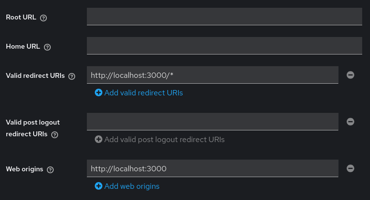


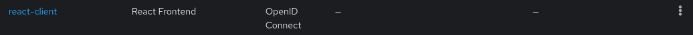

### 4. Création des rôles et utilisateurs 

- Rôles :
  - `ROLE_ADMIN`
  - `ROLE_STUDENT`
- Utilisateurs :
  - `user1` → rôle `ROLE_STUDENT`
  - `admin1` → rôle `ROLE_ADMIN`

### 5. Vérification de l’endpoint `/userinfo`

Keycloak renvoie les informations de l’utilisateur connecté (username, email, etc.) à partir d’un **access token** valide.

#### 5.1. URL de l’endpoint `/userinfo`

Pour le realm `elearning-realm`, l’URL utilisée est : http://localhost:8080/realms/elearning-realm/protocol/openid-connect/userinfo


#### 5.2. Obtention d’un access token avec Postman

1. Activer temporairement le flow **Direct Access Grants** sur le client `react-client` (pour faciliter les tests) :
   - Dans la console Keycloak : **Clients** → `react-client` → onglet **Settings**.
   - Activer **Direct access grants** = ON.
   - Sauvegarder.


   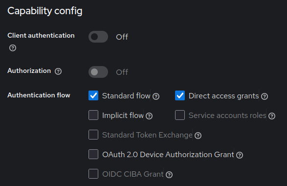
2. Dans Postman, envoyer une requête **POST** vers l’endpoint de token : http://localhost:8080/realms/elearning-realm/protocol/openid-connect/token

   - Headers :
     - `Content-Type: application/x-www-form-urlencoded`
   - Body (x-www-form-urlencoded) :
     - `grant_type` = `password`
     - `client_id` = `react-client`
     - `username` = `user1` (ou `admin1`)
     - `password` = mot de passe de l’utilisateur (ex. `1234`)
3. La réponse contient un champ `access_token` (JWT). On copie cette valeur.

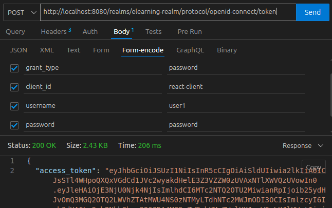

#### 5.3. Appel de `/userinfo` avec le token

Dans Postman :

1. Créer une requête **GET** vers :    http://localhost:8080/realms/elearning-realm/protocol/openid-connect/userinfo

2. Ajouter le header : `Authorization: Bearer <access_token>`
3. Envoyer la requête.

Réponse :

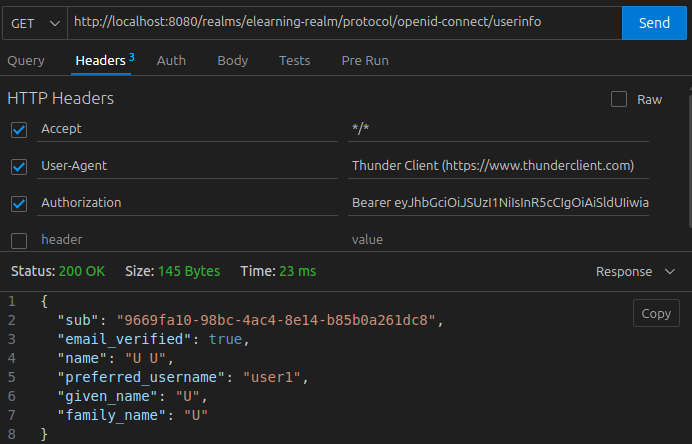

---

##  Partie 2 — Sécurisation du backend Spring Boot

### 2.1. Création du projet Spring Boot

Le backend sera une API REST sécurisée par JWT (tokens Keycloak).

Création avec **Spring Initializr** :
- Site : `https://start.spring.io`
- Options principales :
  - Project : **Maven**
  - Spring Boot : version (3.x)
  - Packaging : `jar`
  - Java : 17 
- Dépendances à ajouter : **Spring Web**, **Spring Security**, **OAuth2 Resource Server**

### 2.2. Configuration du Resource Server (JWT + Keycloak)


Dans `application.properties`, ajouter :

```properties
server.port=8081

spring.security.oauth2.resourceserver.jwt.issuer-uri=http://localhost:8080/realms/elearning-realm
```

- `issuer-uri` : indique à Spring Security où récupérer les méta-données (JWKs, etc.) pour valider les tokens.

Ensuite, créer une configuration de sécurité, par exemple `SecurityConfig` :

```java
@Configuration
@EnableMethodSecurity
public class SecurityConfig {

    @Bean
    SecurityFilterChain securityFilterChain(HttpSecurity http) throws Exception {
        http
            .csrf(csrf -> csrf.disable())
            .authorizeHttpRequests(auth -> auth
                .requestMatchers("/actuator/health").permitAll()
                .anyRequest().authenticated()
            )
            .oauth2ResourceServer(oauth2 -> oauth2.jwt());

        return http.build();
    }
}
```

- désactive CSRF (API stateless),
- exige une authentification pour toutes les requêtes.
- active le mode **Resource Server** avec validation JWT.

### 2.3. Endpoints de l’API : `/courses` et `/me`

Créer un contrôleur REST, par exemple `CourseController`, avec les endpoints demandés :

- `GET /courses` → accessible à STUDENT et ADMIN
- `POST /courses` → réservé à ADMIN
- `GET /me` → renvoie les claims du token

Exemple :

```java
@RestController
@RequestMapping("/api")
public class CourseController {

    @GetMapping("/courses")
    public List<String> getCourses() {
        return List.of("Spring Security", "React & OIDC", "Keycloak Basics");
    }

    @PostMapping("/courses")
    public String addCourse(@RequestBody String courseName) {
        return "Course added: " + courseName;
    }

    @GetMapping("/me")
    public Map<String, Object> me(@AuthenticationPrincipal Jwt jwt) {
        return jwt.getClaims();
    }
}
```

À ce stade, les endpoints existent mais ne sont pas encore restreints par rôle.

### 2.4. Activation de la sécurité par rôle avec `@PreAuthorize`

Keycloak place les rôles du realm dans le claim `realm_access.roles` du token JWT. On les transforme en autorités Spring, puis on protège les méthodes avec `@PreAuthorize`.

Exemple de conversion des rôles Keycloak en autorités Spring :

```java
@Bean
JwtAuthenticationConverter jwtAuthenticationConverter() {
    JwtAuthenticationConverter converter = new JwtAuthenticationConverter();
    converter.setJwtGrantedAuthoritiesConverter(jwt -> {
        Map<String, Object> realmAccess = jwt.getClaim("realm_access");
        if (realmAccess == null) {
            return List.of();
        }
        List<String> roles = (List<String>) realmAccess.get("roles");
        if (roles == null) {
            return List.of();
        }
        return roles.stream()
                .map(SimpleGrantedAuthority::new)
                .toList();
    });
    return converter;
}
```

À intégrer dans `SecurityConfig`, puis l’utiliser :

```java
.oauth2ResourceServer(oauth2 -> oauth2
    .jwt(jwt -> jwt.jwtAuthenticationConverter(jwtAuthenticationConverter()))
);
```

Dans le contrôleur, on ajoute les annotations :

```java
@PreAuthorize("hasAnyAuthority('ROLE_STUDENT', 'ROLE_ADMIN')")
@GetMapping("/courses")
public List<String> getCourses() { ... }

@PreAuthorize("hasAuthority('ROLE_ADMIN')")
@PostMapping("/courses")
public String addCourse(@RequestBody String courseName) { ... }
```

- un token avec le rôle `ROLE_STUDENT` ou `ROLE_ADMIN` peut appeler `GET /courses`,
- seul un token avec `ROLE_ADMIN` peut appeler `POST /courses`.

### 2.5. Tests des endpoints avec Postman

1. **Obtenir un token STUDENT (user1)** :
   - Requête **POST** vers :
     `http://localhost:8080/realms/elearning-realm/protocol/openid-connect/token`
   - Body (x-www-form-urlencoded) :
     - `grant_type=password`
     - `client_id=react-client`
     - `username=user1`
     - `password=password` (ou autre)
     - `scope=openid`
   - Récupérer `access_token`.


   
2. **Tester `GET /courses`** :
   - Requête **GET** vers :
     `http://localhost:8081/api/courses`
   - Header :
     - `Authorization: Bearer <access_token>`
   - Attendu : **200 OK** avec la liste des cours (user STUDENT autorisé).


   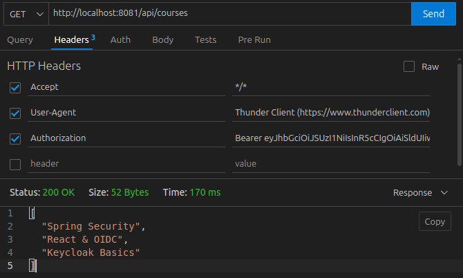
3. **Tester `POST /courses` avec STUDENT** :
   - Requête **POST** vers :
     `http://localhost:8081/api/courses`
   - Body JSON simple, par exemple : `"New Course"`.
   - Header `Authorization` avec le token de `user1`.
   - Attendu : **403 Forbidden** (rôle insuffisant).


   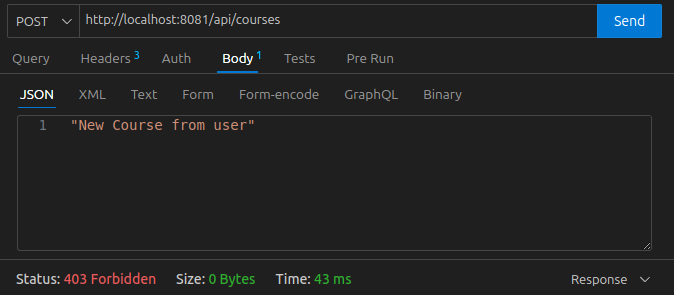
4. **Obtenir un token ADMIN (admin1)** :
   - Même requête sur `/token`, avec :
     - `username=admin1`
     - `password=motDePasseAdmin`
   - Récupérer `access_token`.

5. **Tester `POST /courses` avec ADMIN** :
   - `POST http://localhost:8081/api/courses` avec le token d’`admin1`.
   - Attendu : **200 OK** → le cours est ajouté.


   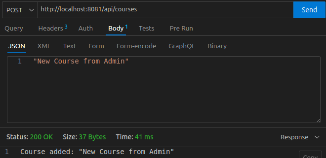
6. **Tester `GET /me`** :
   - `GET http://localhost:8081/api/me` avec n’importe quel token valide.
   - Attendu : JSON contenant les claims du token (username, roles, etc.).


   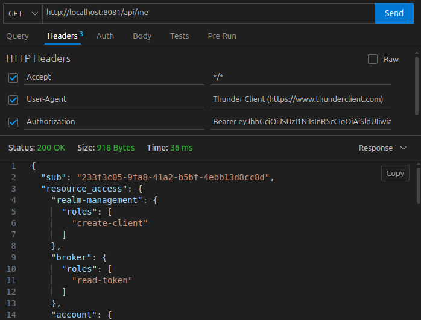


---

## Partie 3 et 4 — Intégration du frontend React avec Keycloak et communication sécurisée React Spring Boot

### 3.1. Création du projet React


```bash
npx create-react-app elearning-frontend
cd elearning-frontend
npm start
```


### 3.2. Installation de `keycloak-js` et des dépendances


```bash
npm install keycloak-js axios react-router-dom
```

- `keycloak-js` : SDK officiel Keycloak pour le navigateur.
- `axios` : client HTTP pour appeler le backend et l’endpoint `/userinfo`.
- `react-router-dom` : routing côté client (pages protégées par rôle).


### 3.3. Initialisation de Keycloak au démarrage de l’app


1. Créer un fichier `src/keycloak.js` :

```js
import Keycloak from 'keycloak-js';

const keycloak = new Keycloak({
  url: 'http://localhost:8080',
  realm: 'elearning-realm',
  clientId: 'react-client',
});

export default keycloak;
```

2. Modifier `src/index.js` pour initialiser Keycloak avant de rendre l’application :

```js
import React from 'react';
import ReactDOM from 'react-dom/client';
import App from './App';
import keycloak from './keycloak';

keycloak
  .init({ onLoad: 'login-required', checkLoginIframe: false })
  .then(() => {
    const root = ReactDOM.createRoot(document.getElementById('root'));
    root.render(<App keycloak={keycloak} />);
  })
  .catch((err) => {
    console.error('Erreur d’initialisation Keycloak', err);
  });
```

- au chargement de React, l’utilisateur est redirigé vers Keycloak pour se connecter,
- après login, il est renvoyé vers `http://localhost:3000`.

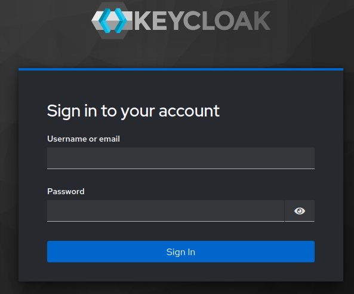

### 3.4. Récupération des informations utilisateur (`/userinfo`) et des rôles (`/me`)


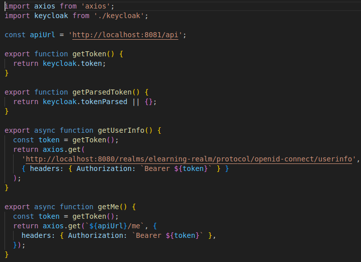

### 3.5. Protection de l’interface React par rôle

- créer deux composants React :
  - `CoursesPage` (liste des cours),
  
  
  - `AdminCoursesPage` (gestion / ajout de cours),

  
- configurer le routing avec `react-router-dom` :
  - `/courses` → `CoursesPage`,
  - `/admin/courses` → `AdminCoursesPage`.


Créer un composant `ProtectedRoute` qui vérifie les rôles   :

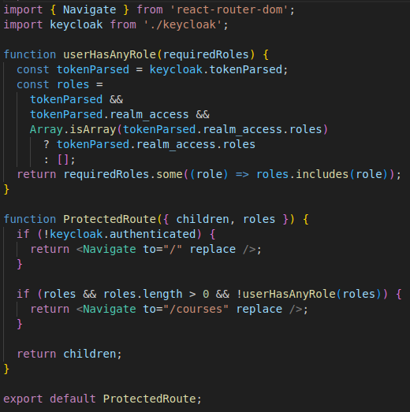

### 3.6. Affichage du profil et bouton Logout


- afficher le prénom, nom, email à partir de `getUserInfo()` ou directement depuis `keycloak.tokenParsed`,
- le bouton **Logout**  appelle :

```js
keycloak.logout({ redirectUri: window.location.origin });
```

Cela redirige vers Keycloak pour la déconnexion puis renvoie vers l’application React.

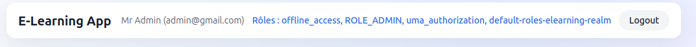


---


